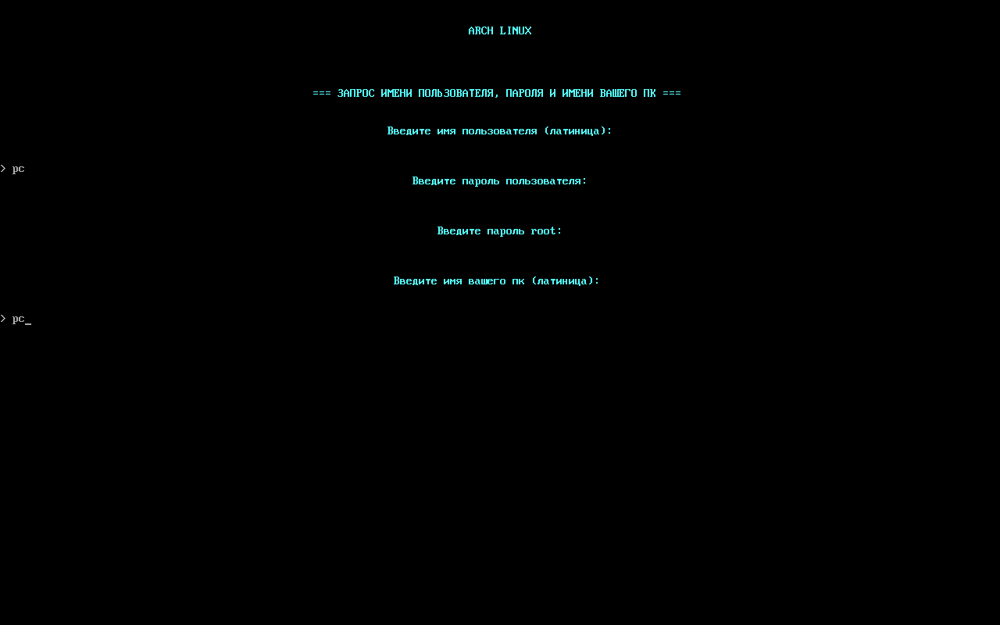

# Установка Arch Linux !

## Описание

- скрипт для атоматизации установки Arch Linux с русской локализацией
- скрипт предназначен для систем с EFI биос и с современными накопителями (ssd и nvme)
- разметка диска может быть в атоматическом режиме либо по вашему усмотрению
- форматирование в 2-х файловых системах - btrfs или ext4
- файловая система btrfs с подтомами ( @  @ home @snapshots @var @log @cache)
- в качестве рабочего стола KDE PLASMA
- скрипт писал для себя с быстрой установкой и фс btrfs , потом уже дополнил ручной разметкой.

## Установка

- Скачиваем образ [Arch Linux](https://archlinux.org)
- Записываем образ на флешку с помощью [Rufus](https://rufus.ie/ru/) (Windows), [Ventoy](https://www.ventoy.net/en/index.html) ,[BalenaEtcher](https://etcher.balena.io/), [UNetbootin](https://unetbootin.github.io/)
- Загружаемся с флешки в live образ
- Oбновляем репозитарии и устанавливаем git :
```bash
pacman -Sy git
```
- Скачиваем репозитарий с github:
```bash
git clone https://github.com/Cor6enDa11as/archinstall.git
```
- Переходим в директорию со скриптом и запускаем его:
```bash
cd archinstall
./arch
```
- Создаём пользователя,задаём пароль,вводим имя пк


- Выбираем часовой пояс и город


- Выбираем диск для установки системы


- Выбираем как размечать диск . Если "авто" - создаётся два раздела (EFI и ROOT) . Если "ручная" - выбираете на ваше усмотрение.


- Выбираем файловую систему для корневого раздела.


- Если выбрали "авто" - далее установка.


- Если выбрали "ручная" - вводим размеры разделов . EFI и ROOT - обязательные разделы . HOME и SWAP , если не нужны - пропускаем (жмём просто "Enter")


- Если создавали домашний раздел , выбираем файловую систему.


- На этом все муки завершены , наслаждаемся установкой )


## Важно

### Скрипт удаляет все данные с диска!!!

### Скрипт предоставляется "как есть". Автор не несёт ответственности за возможные повреждения данных или системы. Перед использованием рекомендуется:

- Сделать резервную копию важных данных
- Протестировать скрипт в виртуальной машине
- Внимательно изучить код скрипта

 

  
